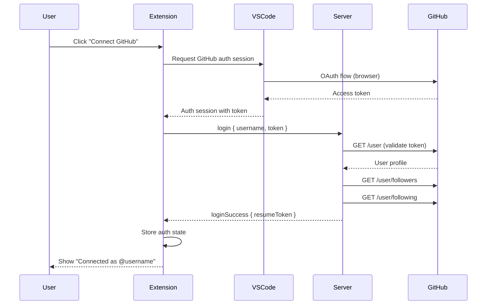

# Feature: GitHub OAuth Authentication

**Status**: Proposed
**Owner**: Dev
**Priority**: Critical (Phase 1)

---

## Purpose

Allow users to authenticate with their GitHub account to:
- Identify themselves uniquely across sessions
- Automatically discover followers/following relationships
- Enable presence sharing with their GitHub network

---

## Business Rules

1. **GitHub is the primary identity** — Users are uniquely identified by `github_id`
2. **Guest mode alternative** — Users can continue as guest with a self-chosen username
3. **Token validation** — Server validates GitHub tokens with GitHub API, not trusting client claims
4. **Session persistence** — Authentication state persists across VS Code restarts
5. **Graceful degradation** — If GitHub API is down, cached relationships are used

---

## Main Flow

---

## Edge Cases

| Case | Behavior |
|------|----------|
| GitHub token expired | Prompt re-authentication silently |
| GitHub API rate limit | Use cached relationships, retry later |
| User revokes OAuth app | Detect 401, clear local state, prompt re-auth |
| Network failure during auth | Show error, allow retry |
| User has 0 followers/following | Show empty network, allow invite codes |

---

## Test Flows

### TST-AUTH-001: Happy Path Authentication
**Level**: Integration
**Preconditions**: User has GitHub account, server running
**Steps**:
1. Click "Connect GitHub" button
2. Complete OAuth in browser
3. Wait for server response

**Expected Result**:
- Status bar shows username
- Sidebar shows "Connected" status
- Server has user record with github_id

### TST-AUTH-002: Invalid Token Rejection
**Level**: Integration
**Preconditions**: Server running
**Steps**:
1. Send login message with invalid token

**Expected Result**:
- Server responds with error
- User not added to online list

### TST-AUTH-003: Guest Mode Fallback
**Level**: Integration
**Preconditions**: User chooses guest mode
**Steps**:
1. Click "Continue as Guest"
2. Enter username "TestGuest123"

**Expected Result**:
- Status bar shows "TestGuest123 (Guest)"
- Server accepts connection without token
- No GitHub relationships loaded

### TST-AUTH-004: Session Persistence
**Level**: Integration
**Preconditions**: User previously authenticated
**Steps**:
1. Close VS Code
2. Reopen VS Code

**Expected Result**:
- Extension auto-reconnects with stored credentials
- No manual re-authentication required

---

## Definition of Done

- [ ] VS Code OAuth flow works with `vscode.authentication.getSession`
- [ ] Server validates tokens against GitHub API
- [ ] Followers/following fetched and stored
- [ ] Guest mode works without GitHub
- [ ] Auth state persists via `globalState`
- [ ] All TST-AUTH-* tests pass
- [ ] Error handling for all edge cases
