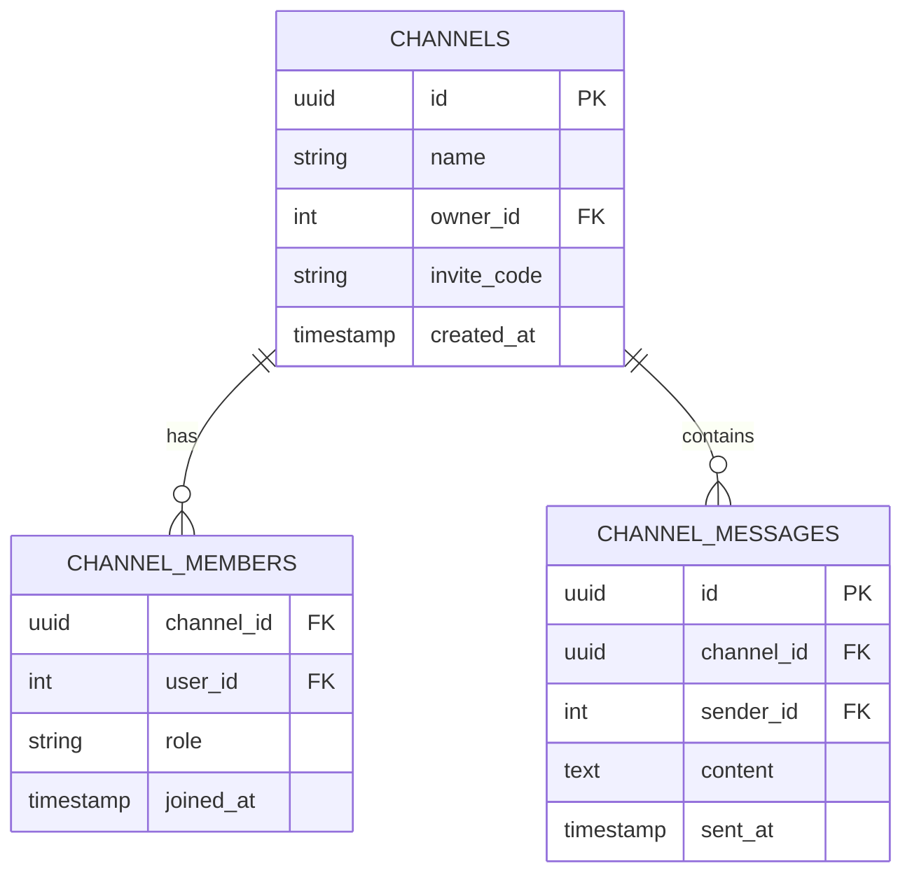
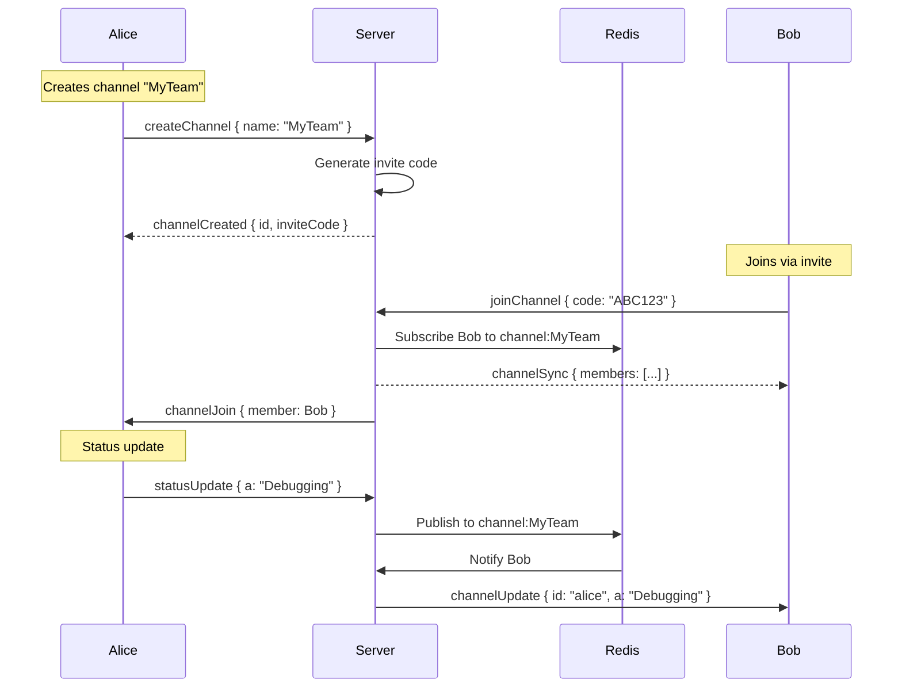

# Feature: Group Channels

**Status**: Proposed
**Owner**: Dev
**Priority**: High (Phase 2)

---

## Purpose

Enable team presence and group communication:
- Create channels for teams/projects
- See activity of all channel members in one view
- Send messages to entire channel

**Key Differentiator**: Viscord only supports 1-on-1 relationships. Group channels let teams see each other's status.

---

## Business Rules

1. **Channel ownership** — Creator is admin, can invite/remove members
2. **Visibility** — Channel members can see each other's status regardless of GitHub relationship
3. **Capacity** — Max 50 members per channel (prevents O(N²) issues)
4. **Invite system** — Join via invite code (6 chars, expires in 7 days)
5. **Privacy** — Channel activity is only visible to members

---

## Data Model



---

## Protocol Extensions

### New Message Types

| Type | Code | Direction | Purpose |
|------|------|-----------|---------|
| channelSync | `cs` | S→C | Initial channel members status |
| channelUpdate | `cu` | S→C | Member status change in channel |
| channelJoin | `cj` | S→C | New member joined |
| channelLeave | `cl` | S→C | Member left |
| channelMsg | `cm` | Bidirectional | Channel chat message |
| createChannel | `cc` | C→S | Create new channel |
| joinChannel | `jc` | C→S | Join via invite code |

### Example: Channel Sync

```json
{
  "t": "cs",
  "channelId": "abc123",
  "name": "MyTeam",
  "members": [
    { "id": "alice", "s": "Online", "act": "Coding" },
    { "id": "bob", "s": "Away", "act": "Idle" }
  ]
}
```

---

## Main Flow



---

## Test Flows

### TST-CHANNEL-001: Create Channel
**Level**: Integration
**Steps**: Alice creates channel named "DevTeam"
**Expected**: Channel created, invite code returned

### TST-CHANNEL-002: Join via Invite
**Level**: Integration
**Steps**: Bob joins using Alice's invite code
**Expected**: Bob receives member list, Alice receives join notification

### TST-CHANNEL-003: Channel Presence Sync
**Level**: Integration
**Steps**: Alice changes status while in channel
**Expected**: Bob receives delta update for Alice in channel context

### TST-CHANNEL-004: Leave Channel
**Level**: Integration
**Steps**: Bob leaves channel
**Expected**: Alice receives leave notification, Bob no longer sees channel

---

## UI Design

### Sidebar Structure
```
▼ CHANNELS
  ▼ MyTeam (3 online)
    ● alice - Coding TypeScript
    ◐ bob - Away
    ○ charlie - Offline
  ▶ Project-X (1 online)
▼ FRIENDS
  ● dave - Debugging Go
```

### Create Channel Dialog
- Name input (3-30 chars)
- Create button → shows invite code
- Copy invite code button

---

## Definition of Done

- [ ] Database schema created (channels, memberships, messages)
- [ ] Server handlers for create/join/leave
- [ ] Redis pub/sub per channel (`channel:{id}`)
- [ ] Client sidebar shows channels section
- [ ] Invite code generation and validation
- [ ] All TST-CHANNEL-* tests pass
