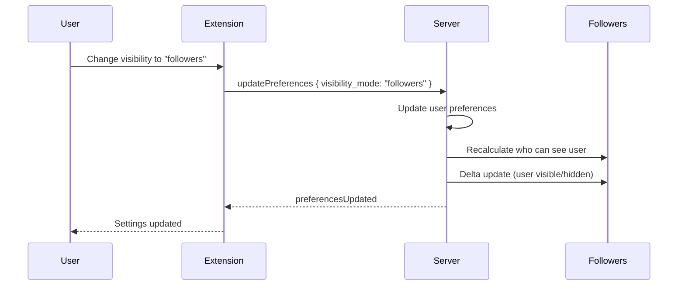
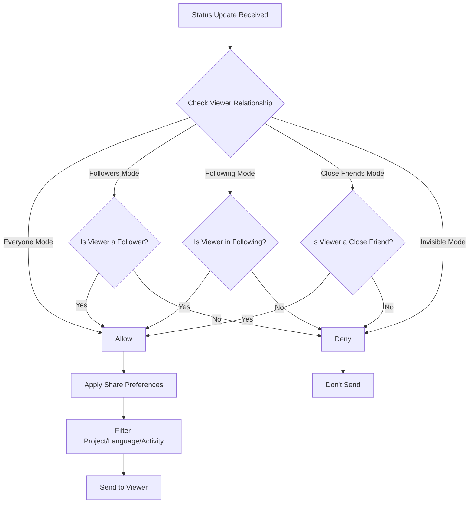

# Feature: Privacy Controls

**Status**: Proposed
**Owner**: Dev
**Priority**: High (Phase 1)

---

## Purpose

Give users full control over who can see their online status and activity:
- Control visibility to different groups
- Choose what information to share
- Go invisible when needed

---

## Business Rules

1. **Visibility Modes** — 5 levels of visibility control
2. **Share Preferences** — Independently toggle project, language, activity
3. **Real-time effect** — Privacy changes apply immediately to all viewers
4. **Server-enforced** — Privacy is enforced server-side, not client-side

---

## Visibility Modes

| Mode | Description | Who Can See |
|------|-------------|-------------|
| `everyone` | Fully public | All connected users |
| `followers` | Followers only | GitHub users who follow you |
| `following` | Following only | GitHub users you follow |
| `close-friends` | Close friends only | Pinned close friends |
| `invisible` | Hidden | Nobody (server knows you're online) |

---

## Share Preferences

| Preference | Default | Effect When Off |
|------------|---------|-----------------|
| `shareProjectName` | true | Project shown as empty |
| `shareLanguage` | true | Language shown as empty |
| `shareActivity` | true | Activity shown as "Hidden" |

---

## Main Flow

---

## Main Flow Diagram

---

## Test Flows

### TST-PRIVACY-001: Visibility Mode Enforcement
**Level**: Integration
**Preconditions**: User A (visible to followers), User B follows A, User C does not
**Steps**:
1. A sends status update

**Expected Result**:
- B receives update about A
- C does NOT receive update about A

### TST-PRIVACY-002: Share Preference Filtering
**Level**: Integration
**Preconditions**: User A has `shareProjectName: false`
**Steps**:
1. A is working on "SecretProject"
2. B (follower) requests A's status

**Expected Result**:
- B sees A online, but project field is empty

### TST-PRIVACY-003: Invisible Mode
**Level**: Integration
**Preconditions**: User A sets invisible mode
**Steps**:
1. A goes invisible
2. B (follower) lists online users

**Expected Result**:
- A does NOT appear in B's list
- A can still see others
- Server tracks A as "online" internally

### TST-PRIVACY-004: Real-time Privacy Update
**Level**: Integration
**Preconditions**: A visible, B can see A
**Steps**:
1. A changes to invisible mode

**Expected Result**:
- B immediately receives "user offline" for A
- No delay, real-time update

---

## Definition of Done

- [ ] All 5 visibility modes implemented
- [ ] All 3 share preferences work
- [ ] Privacy enforced server-side
- [ ] Privacy changes apply immediately
- [ ] All TST-PRIVACY-* tests pass
