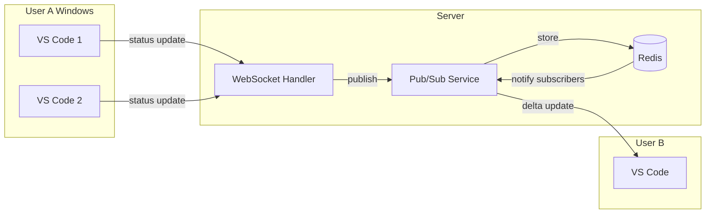
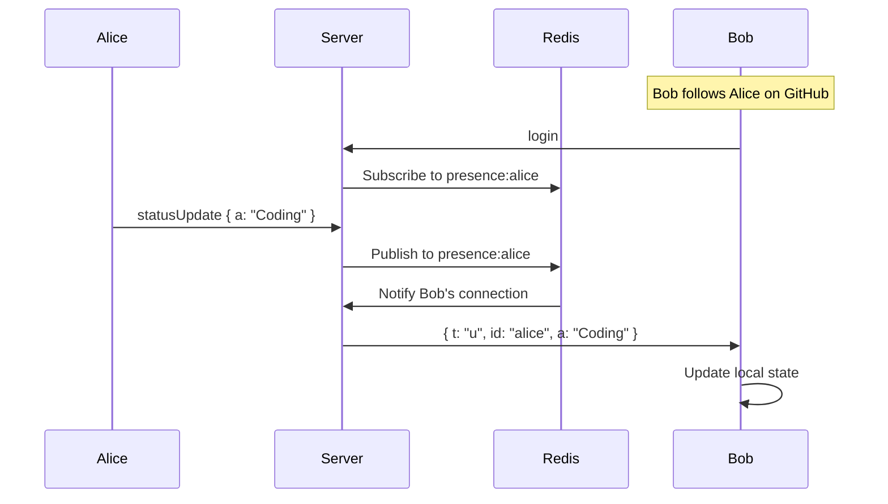

# Feature: Real-time Presence System

**Status**: Proposed
**Owner**: Dev
**Priority**: Critical (Phase 1)

---

## Purpose

Enable users to see what their GitHub network is coding in real-time:
- Who is online
- What activity (Coding, Debugging, Idle)
- What project and language
- When they were last seen (if offline)

---

## Business Rules

1. **O(K) Scalability** — Updates are sent only to interested parties (K = friend count), NOT broadcast to all users
2. **Delta Updates** — Only changed fields are transmitted, not full user objects
3. **2-second debounce** — Aggregate multiple changes before transmitting
4. **5-minute away timeout** — User marked "Away" after 5 minutes of no activity
5. **Session resumption** — Brief disconnects (< 60s) don't trigger offline/online flapping
6. **Multi-window aggregation** — Show most active status across multiple VS Code windows

---

## Architecture: Pub/Sub Model



**Key**: User B subscribes to `presence:userA` channel. When A updates, only B receives the update (not all users).

---

## Protocol: Delta Updates

### Full Sync (on connect)
```json
{
  "t": "sync",
  "users": [
    { "username": "alice", "s": "Online", "a": "Coding", "p": "MyApp", "l": "TypeScript" },
    { "username": "bob", "s": "Away", "a": "Idle", "p": "", "l": "" }
  ]
}
```

### Delta Update (status change)
```json
{
  "t": "u",
  "id": "alice",
  "a": "Debugging"
}
```
Only changed field sent. Client merges into local state.

### User Online
```json
{
  "t": "o",
  "id": "alice",
  "s": "Online",
  "a": "Idle",
  "p": "NewProject",
  "l": "Go"
}
```

### User Offline
```json
{
  "t": "x",
  "id": "alice",
  "ts": 1703789400000
}
```
Client marks user offline, stores timestamp for "last seen".

---

## Main Flow



---

## Edge Cases

| Case | Behavior |
|------|----------|
| User has 1000 followers | Each follower subscribes individually — O(1) update from sender |
| User opens 3 VS Code windows | Server aggregates to "most active" status |
| Brief network drop (< 60s) | Resume token reconnects silently, no offline notification |
| User goes invisible | Publish "offline" event despite being connected |

---

## Test Flows

### TST-PRESENCE-001: Delta Update Delivery
**Level**: Integration
**Preconditions**: Two users connected, B follows A
**Steps**:
1. User A sends `statusUpdate { activity: "Coding" }`
2. Observe message received by User B

**Expected Result**:
- B receives `{ t: "u", id: "A", a: "Coding" }`
- NOT a full user list

### TST-PRESENCE-002: Non-Follower Isolation
**Level**: Integration
**Preconditions**: User C does NOT follow A
**Steps**:
1. User A sends status update

**Expected Result**:
- C receives NO message about A
- Only followers receive updates

### TST-PRESENCE-003: Session Resumption
**Level**: Integration
**Preconditions**: User A connected
**Steps**:
1. Disconnect A's WebSocket
2. Reconnect within 60s with resume token

**Expected Result**:
- No "offline" event sent to followers
- No "online" event on reconnect
- Session continues seamlessly

### TST-PRESENCE-004: Multi-Window Aggregation
**Level**: Integration
**Preconditions**: User A has 2 windows
**Steps**:
1. Window 1: Idle
2. Window 2: Coding

**Expected Result**:
- Followers see "Coding" (highest priority)
- NOT two separate presence entries

---

## Definition of Done

- [ ] Redis pub/sub channels per user implemented
- [ ] Delta updates (not full lists) verified in tests
- [ ] O(K) complexity proven (no full broadcasts)
- [ ] Session resumption working (60s window)
- [ ] Multi-window aggregation working
- [ ] All TST-PRESENCE-* tests pass
